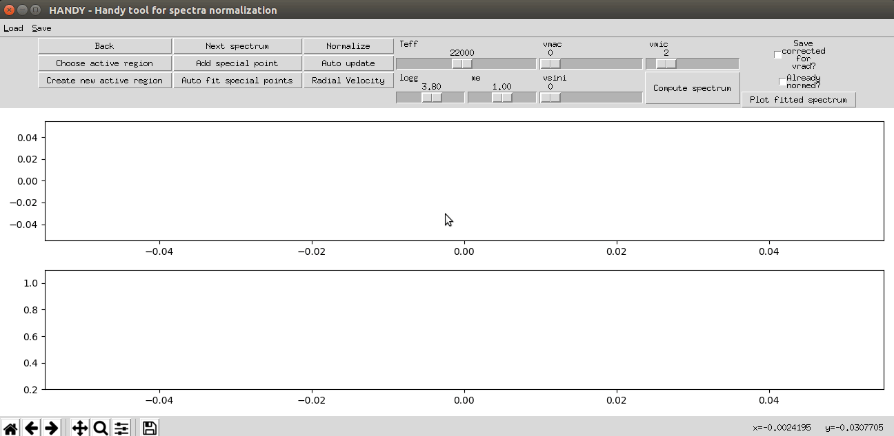
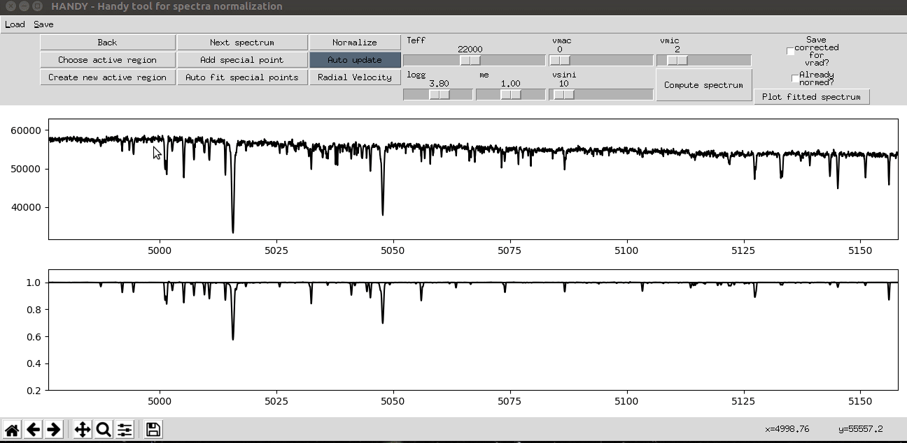
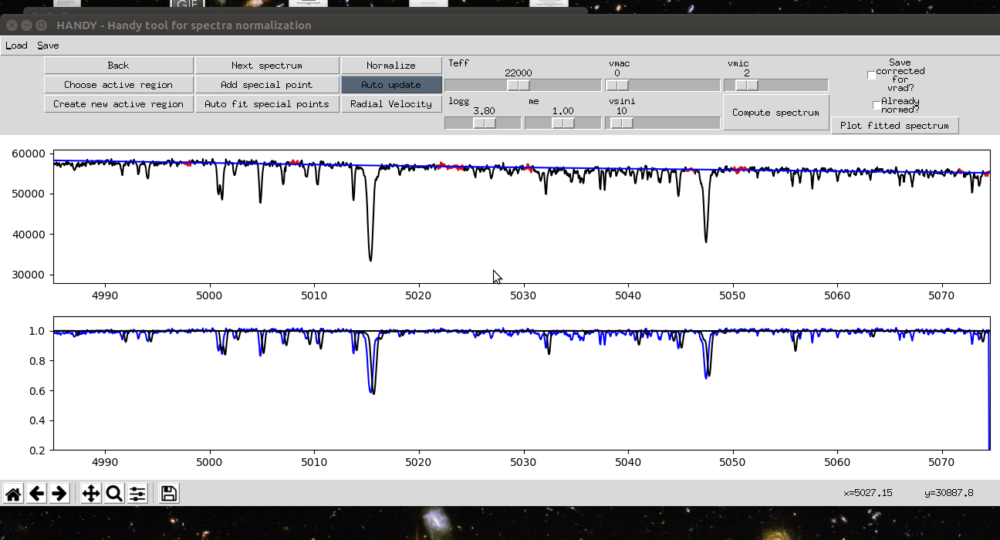
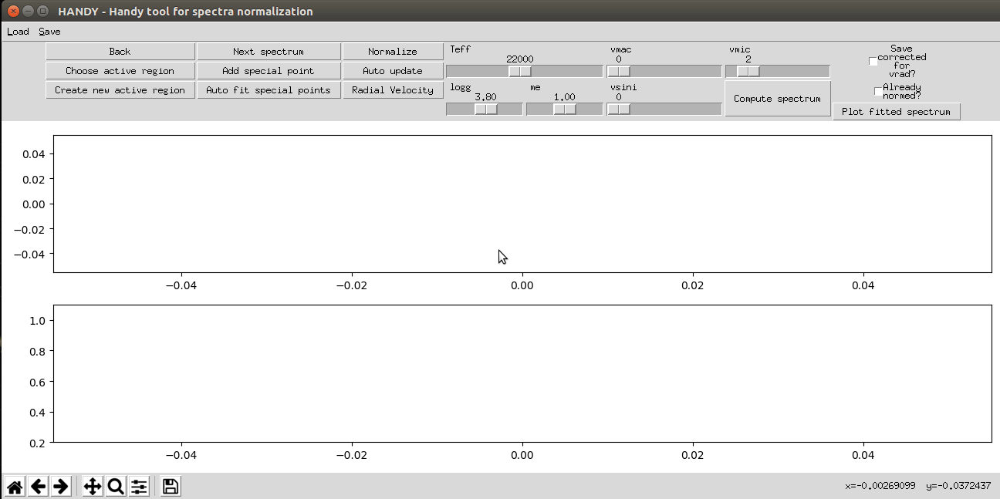

# HANDY - Handy tool for spectra normalization

HANDY is interactive python3 program for spectrum normalization. The normalization process is based on "regions" and "ranges". "Ranges" are continuum parts defined manually by user (or uploaded from file from previous program run) which will be used for continuum level fit. "Regions" are groups of ranges for whom single chebyshev polynomial are fitted. Polynomial fits are connected with the use of Akima'a spline interpolation. The program offers graphical access to theoretical grid of spectra for obtaining an idea about processed star atmosphere parameters and interface for radial velocity correction. 

<p align="center">
  <a href="#key-features">Key Features</a> •
  <a href="#prerequisites">Prerequisites</a> •
  <a href="#download">Download</a> •
  <a href="#installing">Installing</a> •
  <a href="#tutorial">Tutorial</a> •
  <a href="#license">License</a> •
  <a href="#acknowledgments">Acknowledgments</a>
</p>



## Key Features

* Interactive normalization of spectrum in single run
* Portability of continuum ranges between different spectra
* Easy access to precomputed grid of NLTE stars spectra (computed with SYNSPEC, with use of BSTAR2006 models)
  - NLTE line blanketed model atmospheres of hot stars. I. Hybrid Complete Linearization/Accelerated Lambda Iteration Method, 1995, Hubeny, I., & Lanz, T., Astrophysical Journal, 439, 875
* Adding user defined grids
* Radial velocity correction 
* Developed and tested on Linux

## Getting Started

### Prerequisites

* Python3
* Conda - usefull but not necessary

### Download

Two steps:
* Clone the repository or download it as the .zip file
* Download and untar folders with grids in your project catalog
  - Can be downloaded from : https://drive.google.com/open?id=1HoGdsCiT7-sRO5a_YqBjVRrTetkxNvwg
  
### Installing

You need python3 with all needed packages.

The easiest way to work with HANDY is with [Conda enviroment manager](https://conda.io/docs/user-guide/tasks/manage-environments.html#creating-an-environment-from-an-environment-yml-file):

Run in HANDY catalog:
```
conda env create -f environment.yml
```
Activate the HANDY-env enviroment:
```
source activate HANDY-env
```
Verify if enviroment is installed correctly:
```
conda list
```
After that you may want to make symbolic link in your ~/bin/ directory to HANDY.sh file to be able to easly run the program in whole system. Eg. on my system:
```
ln -s ~/repos/HANDY/HANDY.sh ~/bin/HANDY
```
Then you should be able to simply run the program by executing:
```
HANDY
```
in your terminal.

## Tutorial

Page with tutorial is in preparation, but:

### Adding new grid
* Compute your new grid (equally spaced in each dimension) in chosen number of parameters from among effective temperature, surface gravity, metallicity and microturbulence velocity. Code paramters of each spectrum in its file name. Your grid files can be of two types:
  - with wavelength and flux columns in each file,
  - only with flux column in each grid file but with common wavelength file,
* Define your grid in gridsDefinitions.yaml. This file is self explanatory.
* It's done!

### Play with regions end ranges creation/deletion

* Left mause button - create ranges
* Right mouse button - remove the neares range
* Scroll wheel click - change active region to the nearest to cursor 



### Correcting for radial velocity



### Loading predefined continuum file



## License

This project is licensed under the MIT License - see the [LICENSE.txt](LICENSE.txt) file for details

## Acknowledgments

* [iSpec](http://adsabs.harvard.edu/abs/2014A%26A...569A.111B), by. S. Blanco-Cuaresma
* [PyAstronomy](https://github.com/sczesla/PyAstronomy)
* [SciPy](https://www.scipy.org/)
<!---
-->
