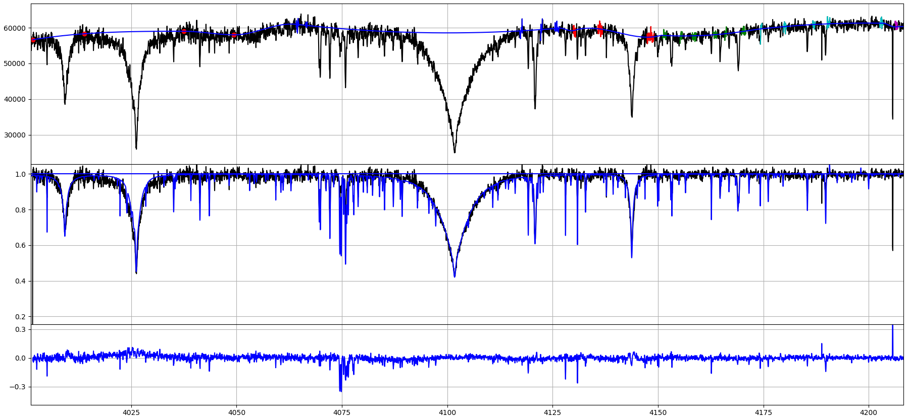
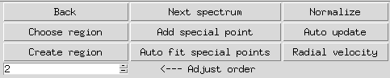
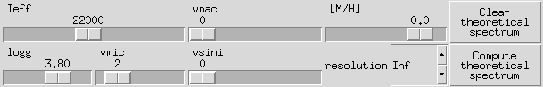

# HANDY - Basics

## Table of Contents
  * [Home](index.md)
  * [Install](install.md)
  * [Basics](basics.md)
  * [Regions and ranges](regions.md)
  * [Points](points.md)
  * [Radial velocity correction](radialVelocity.md)
  * [Grids](grids.md)

### Plots
 * **Top plot** 
    - _Black line_ - observed spectrum which we are working on
    - _Blue line_ - fitted continuum
    - _Red points_ - special points
    - Short _blue/red/green/magenta/cyan/purple_ parts - each color denotes single region, while each highlighted part called range
 * **Middle plot**
    - _Black line_ - normed observed spectrum which we are working on (spectrum/continuum)
    - _Blue line_ - loaded theoretical spectrum
 * **Botton plot**
    - _Blue line_ - residuals of fit (normed spetrum - theoretical spectrum)
  

  
### Buttons

  * **Back** - load last regions/ranges (note: does not modify Points)
  * **Choose region/scroll wheel click** - make it possible to change active region by clicking above it
  * **Create region** - next added range will belong to newly created region and become the actve one
  * **Next spectrum** - Not implemented yet
  * **Add special point** - next click on spectrum will add special Point (more here: [Points](points.md))
  * **Auto fit special points** - automatically normalize all special Points relative to theoretical spectrum
  * **Normalize** - apdate normalization once - usefull when we do not want normalization to update automatically
  * **Auto update** - when clicked after any modification of ranges/Points/uploading continuum, etc. normalization will automatically update
  * **Radial velocity** - open radial velocity correction dialog (note: works only when theoretical spectrum is loaded; more here: [Radial velocity correction](radialVelocity.md))
  * **Adjust order spinbox** - changes order of chebyschev polynomial fitted to _active region_

### Grid interface panel

  * **Clear theoretical spectrum** - clears theoretical spectrum from second plot
  * **Compute theoretical spectrum** - interpolate theoretical spectrum of parameters given by sliders values
  * **Sliders and resolution spinbox** - enable user to set parameters of theoretical spectrum
