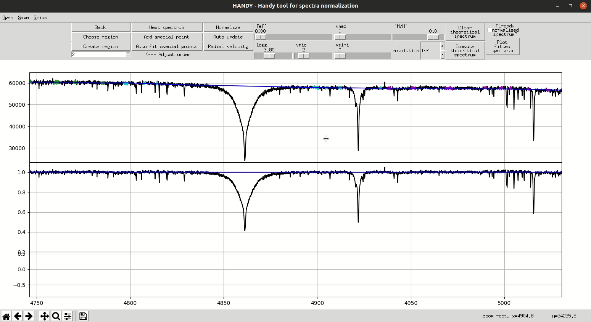

# HANDY - Grids of spectra

## Table of Contents
  * [Home](index.md)
  * [Install](install.md)
  * [Basics](basics.md)
  * [Regions and ranges](regions.md)
  * [Points](points.md)
  * [Radial velocity correction](radialVelocity.md)
  * [Grids](grids.md)

## Grids

Grids of spectra make it possible to compare normalized spectrum to model and establishe some initial guesses for paramters which are often useful further work. Visual interface of grid interface is intuitive, see [Basics](basics.md). During the installation process some predefined grids can be aquired, see [Install](install.md). New grids can be easly added by the user.

## Adding new grid

* Compute your new grid (equally spaced in each dimension) in chosen number of parameters from among effective temperature, surface gravity, metallicity and microturbulence velocity. Code parameters of each spectrum in its file name (eg. "me1.0_teff15000_logg45spec.dat"). Your grid files can be of two types:
  - with wavelength and flux columns in each file,
  - only with flux column in each grid file but with common wavelength file,
* Define your grid in **gridsDefinitions.yaml**. This file is self explanatory. Example of entry for embeded _basicGrid_ can be found below.
* It's done!

## BasicGrid definition in gridsDefinitions.yaml file
```
#-------------------------------- ADD NEXT ONE BY ANALOGY
basicGrid: # give your own, distinct name for each grid
  folderName: "bigGrid" # folder grid name
  #define grid:
  # Paramterers included in grid description:
  teff: True
  logg: True
  vmic: True
  me: True
  # define searching for grid files
  fluxFilesFilter: "*norm" # regexp for obtaining list of grid files with glob()
  # Decoding parameters from file names:
  # program reads all numbers (also in float format) in filename of flux files
  # specify which number corresponds to which parameter (count from 0):
  # if paramter is not included is not important
  fluxNameToParameters:
    teff: 1
    logg: 2
    vmic: 3
    me: 0
  multiplicationFactors:
    teff: 1
    logg: 0.01
    vmic: 1
    me: 1
  # Define reading from grid file
  waveFile: "refWave.dat" # File with reference wavelength, placed in folderName, if None uses waves columns
  skipRows: 0 # No of rows to skip in files with fluxes
  waveColumn: 0 # column with wavelenghts, count from 0
  fluxColumn: 0 # column with flux, count from 0
  comments: "#" # comments sign - default #
```

## Example

Available grids cover most of needed parameter space.


