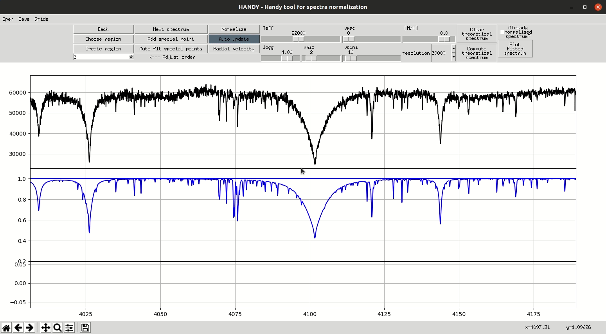

# HANDY - (Special) Points in normalization process

## Table of Contents
  * [Home](index.md)
  * [Install](install.md)
  * [Basics](basics.md)
  * [Regions and ranges](regions.md)
  * [Points](points.md)
  * [Radial velocity correction](radialVelocity.md)
  * [Grids](grids.md)

## What are Special Points?

Special Points are points manually defined by the user, which will be use to fit continuum line. Each point is defined by its **wavelength and ratio** its _y-coordinate_ divided by _median of little range of flux_. Use of ratio insted of y-coordinate make Points portable between defferent spectra we need to normalize. They are needed in places where true continuum is not available in star's spectrum (eg. near Balmer jump). They need to be used with caution because it easy to bias the spectrum by manually adjusting it to expected result. **You should not use them when that is not necessary.**

## The use of Special Points

* **Button _Add special point_** - when this button is active the next left mouse click on the top plot will add special Point
* **Auto fit special points** - (_Be careful with that option!_) when you click this button and theoretical spectrum is available then all special Points will be adjusted to fit normed spectrum to theoretical one in narrow surronding of special Points

## Saving of Special Points

Special points are included in so called _continuum file_ which can be saved by menu option _Save->Save continuum file_. Those files contain also all ranges/regions definitions (see more: [Regions and ranges](regions.md)).

## Example

