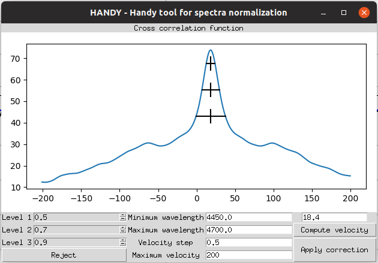

# HANDY - Radial velocity correction

## Table of Contents
  * [Home](index.md)
  * [Install](install.md)
  * [Basics](basics.md)
  * [Regions and ranges](regions.md)
  * [Points](points.md)
  * [Radial velocity correction](radialVelocity.md)
  * [Grids](grids.md)

## Radial velocity correction

Radial velocity correction is the first thing which should be done when starting the process of normalization, because the ranges/regions and special Points cannot be corrected for radial velocity, so they should be defined on spectrum which is in the laboratory wavelength frame.

The correction can be done with radial velocity (RV) dialog which uses cross-correlation function (CCF) to establish best RV value. for cross-correlation **theoretical spectrum and not normalized spectrum** is used, so theoretical spectrum needs to be available.

## Radial velocity dialog window

There are several things which can be adjusted in RV dialog window:
* **minimum and maximum wavelength** - these values define the range for which cross-correlation will be computed
* **Velocity step** - defines velocity step in cross-correlation function
* **Maximum velocity** - defines maximum span of velocity accessible with CCF
* **Level 1|2|3** - Value of velocity is computed using mean value of x-coordinate of central points of three horizontal lines which cross CCF. Levels are numbers from 0 to 1 which defines hight of that lines relative to minimal and maximal values of CCF. (note: if there are more than two crosses for at least one of horizontal lines then RV cannot be computed)
* **Button _Reject_** - close window without applaying any correction
* **Button _Compute correction_** - computes correction and put that value in text box above
* **Button _Apply correction_** - applies radial velocity correction with value of velocity given in text box above, it is possible to set the value of velocity manually

## Example

